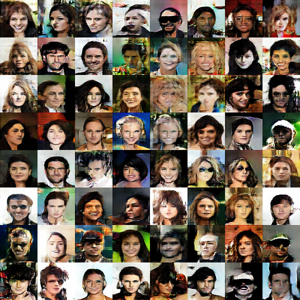
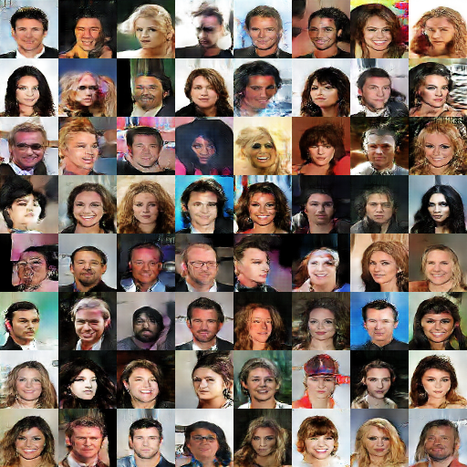
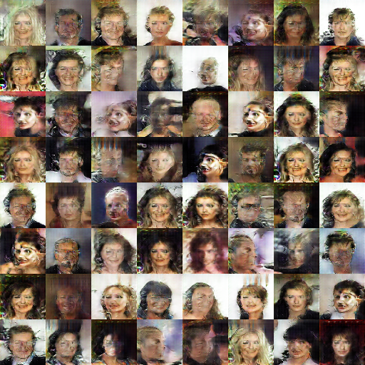

# UPDATING
# Deep Convolutional Generative Adversarial Networks

## Loss Function

* used ``sce loss`` at D/G nets.

## Architecture Networks

* Same as DCGAN paper.

*DIFFS* | *DCGAN Paper* | *ME*  |
 :---:  |     :---:      | :---: |
 **Weight initializer** | ``normal dist`` | ``HE initializer`` |
 **z noise** | ``100`` | ``128`` |

> Normal Distribution Initializer : (µ = 0, σ = 0.02)  
> HE Initializer parameters       : (factor = 1, FAN_AVG, uniform)

## Improvement Point

1. Normalize the inputs
* Tanh as the last layer of the generator output

2. Use a spherical Z
* Sample from a gaussian distribution instead of Uniform distribution: 'np.random.normal'

3. Use Soft and Noisy Labels
* Label Smoothing

4. Avoid Sparse Gradients
* Use Leaky Relu in both D and G

## Tensorboard

> Elapsed Time : ?h ?m ?s with ``todo``

## Result

*Name* | *Global Step 5k* | *Global Step 10k* | *Global Step 20k*
:---: | :---: | :---: | :---:
**DCGAN**      |  |  | 

## To-Do
* 